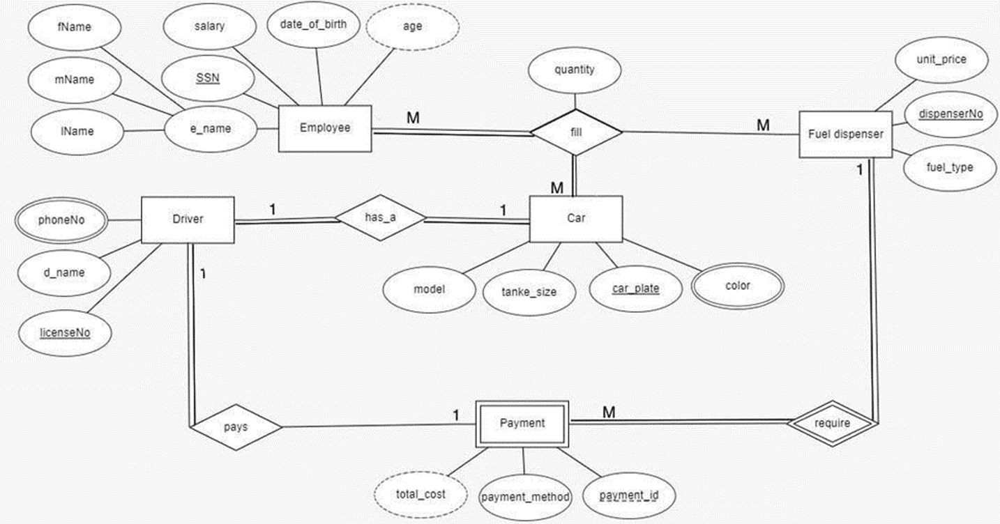

# Gas Station Database Management System

## Overview

This project involves the development of a database system for a gas station. The database is designed to manage various aspects of gas station operations, including employee information, fuel dispensers, payments, drivers, cars, and their associated details. It serves to streamline the process of fueling vehicles and handling transactions efficiently.

## Project Components

### Entity Relationship Diagram (ERD)

### Relational Schema

The relational schema defines the structure of the database tables, including primary and foreign key relationships:

- **Employee(SSN, fName, mName, lName, salary, date_of_birth)**
- **Fuel_dispenser(dispenserNo, unit_price, fuel_type)**
- **Car(car_plate, licenseNo, tanke_size, model)**
- **Driver(licenseNo, payment_id, dispenserNo, d_name)**
- **Driver_phoneNo(licenseNo, phoneNo)**
- **Payment(payment_id, dispenserNo, payment_method)**
- **Car_color(car_plate, color)**
- **Fill(SSN, dispenserNo, car_plate, quantity)**

### DDL and DML Commands

The project includes Data Definition Language (DDL) commands to create the necessary tables and Data Manipulation Language (DML) commands to insert and query data within the database. At least four rows have been inserted into each table to ensure comprehensive testing and functionality.

## Conclusion

This gas station database project provides a structured approach to managing the operations of a gas station. By utilizing an organized database system, it enhances efficiency in handling customer transactions, employee management, and fuel dispensing operations. 
